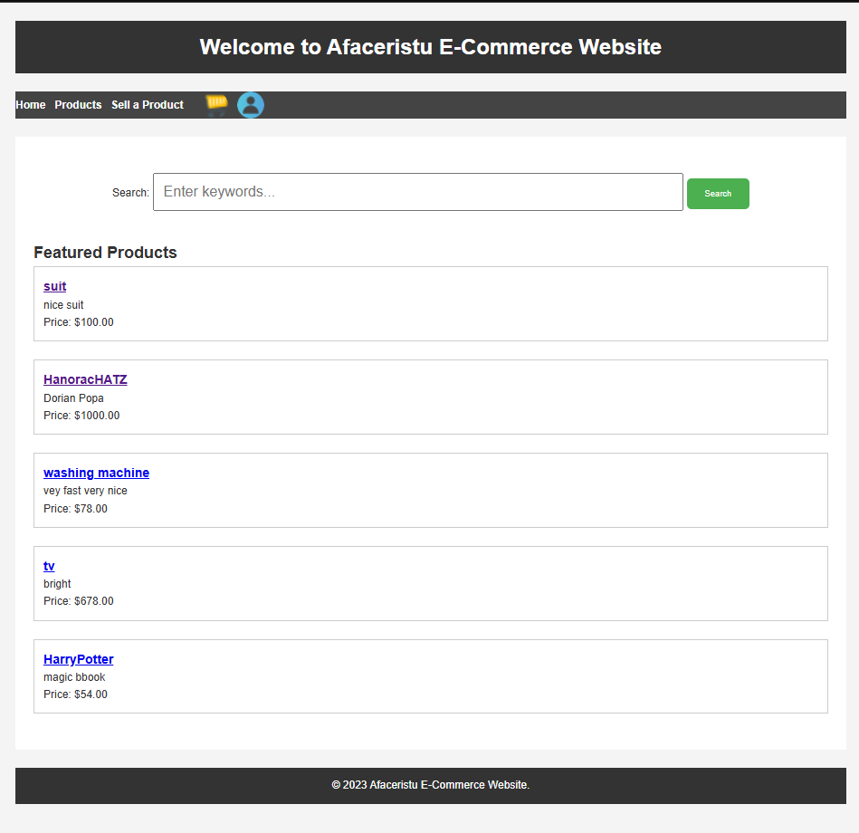
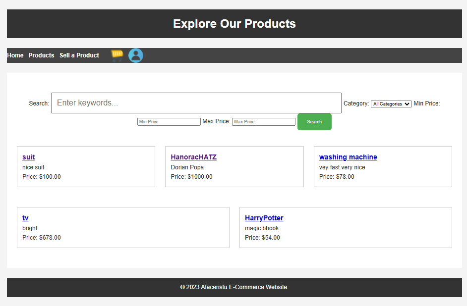
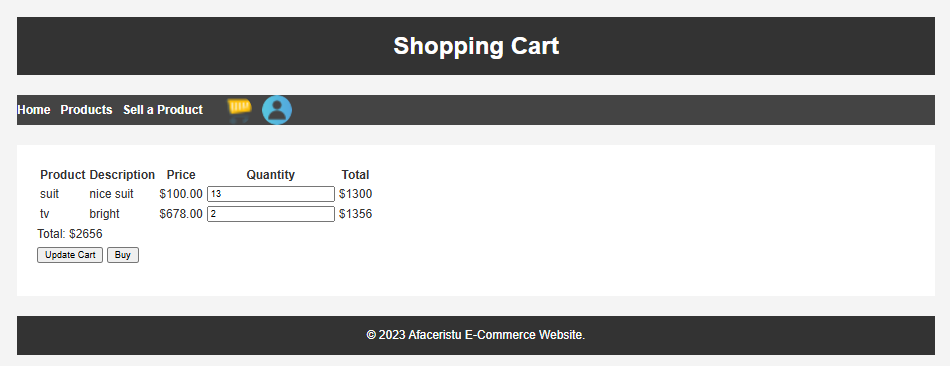
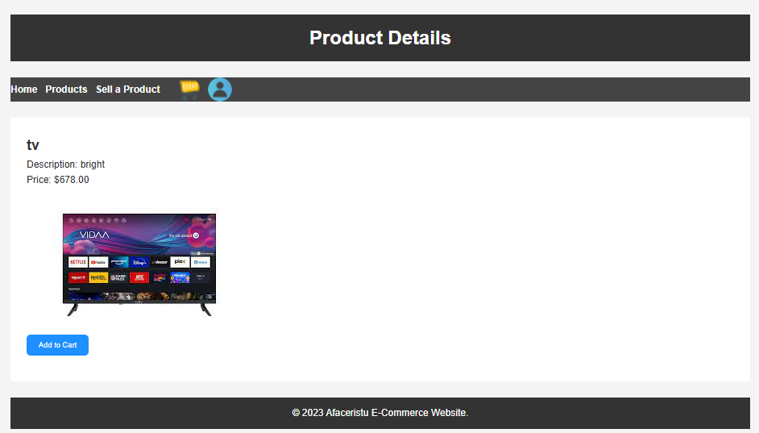
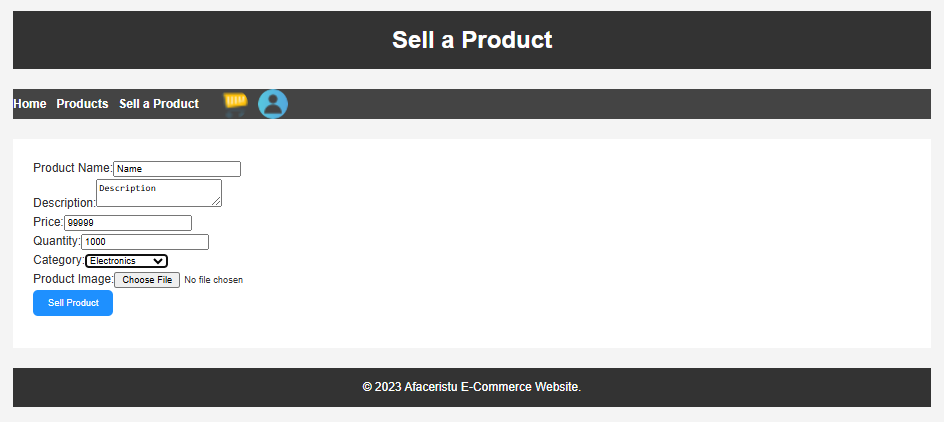

# Afaceristu E-Commerce Website

## Overview
Afaceristu is an e-commerce website developed for a university project. It allows users to browse, search, and purchase products. Sellers can list items for sale, and users can register, log in, and manage their carts.

## Features
- User authentication (Register/Login)
- Product search and filtering
- Shopping cart functionality
- Secure checkout process
- User profiles and purchase history

## Technologies Used
- **Backend**: PHP, MySQL
- **Frontend**: HTML, CSS
- **Database**: MySQL
- **Version Control**: GitHub

## Installation Guide
1. Clone the repository:
   ```bash
   git clone https://github.com/your-repo-url.git
   ```
2. Set up a MySQL database and update `database.php` with your credentials:
   ```php
   $servername = "your_server";
   $username = "your_username";
   $password = "your_password";
   $database = "your_database";
   ```
3. Start a local server using XAMPP, MAMP, or WAMP.
4. Navigate to `http://localhost/ecommerce/home.php` in your browser.

## Screenshots
### Home Page


### Product Listings


### Shopping Cart


### Prodct Page


### Sell Page


## Database Schema
- **Users Table**:
  ```sql
  CREATE TABLE IF NOT EXISTS users (
      id INT(6) UNSIGNED AUTO_INCREMENT PRIMARY KEY,
      username VARCHAR(50) NOT NULL,
      password VARCHAR(255) NOT NULL,
      email VARCHAR(50) NOT NULL,
      reg_date TIMESTAMP DEFAULT CURRENT_TIMESTAMP ON UPDATE CURRENT_TIMESTAMP
  );
  ```
- **Products Table**:
  ```sql
  CREATE TABLE IF NOT EXISTS products (
      id INT(6) UNSIGNED AUTO_INCREMENT PRIMARY KEY,
      name VARCHAR(255) NOT NULL,
      description TEXT,
      price DECIMAL(10,2) NOT NULL,
      quantity_in_stock INT(6) NOT NULL,
      images TEXT,
      category VARCHAR(50),
      created_at TIMESTAMP DEFAULT CURRENT_TIMESTAMP,
      updated_at TIMESTAMP DEFAULT CURRENT_TIMESTAMP ON UPDATE CURRENT_TIMESTAMP
  );
  ```

## Future Improvements
- Implement secure payment gateway integration
- Improve UI/UX with modern frameworks (Bootstrap, React)


